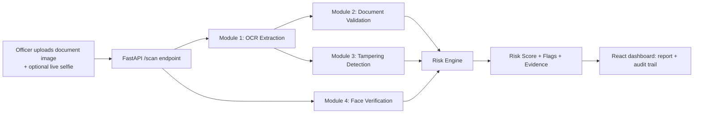

# System Architecture

## 1. High-level flow

## 2. Why this stack

| Concern | Choice | Reason |
|---|---|---|
| Backend | Python 3.11 + FastAPI | Best-in-class ecosystem for OCR/CV (OpenCV, pytesseract, NumPy, Pillow); async, auto-generated OpenAPI docs |
| OCR | Tesseract (`pytesseract`) with an `EngineProtocol` abstraction | Free, offline, swappable for a cloud OCR/LLM-vision engine later without touching callers |
| MRZ parsing | Hand-rolled ICAO 9303 parser + checksum | Passports/visas carry a machine-readable zone with a **real, deterministic check-digit algorithm** — this is genuine verification, not a heuristic, and works even if OCR text is noisy elsewhere |
| Tampering detection | Error Level Analysis (ELA) + EXIF/metadata forensics + ORB copy-move detection | Classic, well-documented digital-forensics techniques that run offline with no training data and generalize to any image |
| Face verification | OpenCV Haar/DNN face detector + histogram/ORB similarity, pluggable for `face_recognition`/`insightface` | Works with zero extra native deps on Windows; upgradeable to embedding-based matching where dlib/onnxruntime is available |
| Risk scoring | Weighted rule engine over module outputs | Transparent and explainable to a human officer — a hard requirement for a security decision system |
| Frontend | React 18 + TypeScript + Vite + Tailwind + Framer Motion | Fast dev loop, small bundle, animation support for a "control room" feel |

## 3. Module breakdown

### Module 1 — OCR Extraction (`backend/app/modules/ocr/`)
- `engine.py` — wraps the OCR backend, returns raw text + bounding boxes.
- `mrz_parser.py` — locates and decodes the Machine Readable Zone (TD3 for
  passports, TD1 for ID cards), verifies check digits per ICAO 9303 Annex A.
- `field_extractors.py` — regex/heuristic extraction of named fields
  (name, DOB, expiry, document number, visa type, stay duration...) for
  documents without an MRZ (visas, driving licences, permits).

### Module 2 — Document Validation (`backend/app/modules/validation/`)
- `schemas.py` — per-document-type Pydantic schemas describing the "official
  standard" shape of each field (formats, ranges).
- `rules_engine.py` — runs a battery of rules: expiry date in the past,
  issue date after expiry, DOB implying an impossible age, document number
  checksum, MRZ-vs-visual-zone cross-check, nationality/country code validity.

### Module 3 — Tampering Detection (`backend/app/modules/tampering/`)
- `ela.py` — Error Level Analysis: re-compresses the image at a known JPEG
  quality and diffs it against the original; genuine photos degrade evenly,
  pasted/edited regions light up because they were compressed a different
  number of times.
- `metadata_analysis.py` — EXIF/software-tag inspection (editor signatures,
  missing/rewritten timestamps, resave count).
- `copy_move.py` — ORB keypoint matching within the same image to catch
  copy-pasted regions (classic copy-move forgery, e.g. cloning a stamp).
- `tampering_engine.py` — aggregates the three signals into a tampering
  sub-score with human-readable evidence.

### Module 4 — Face Verification (`backend/app/modules/face/`)
- `detector.py` — locates the document photo face and the live-capture face.
- `verifier.py` — computes a similarity score between the two faces (pluggable
  backend: lightweight histogram/ORB comparator by default, or a proper face
  embedding model such as `face_recognition`/`insightface` when installed).

### Risk Engine (`backend/app/modules/risk/risk_engine.py`)
Combines: validation failures (hard flags), tampering sub-score, face
similarity, and document-type base risk into one 0–100 score with a verdict
(`CLEAR` / `REVIEW` / `REJECT`) and an evidence list an officer can read in
under 5 seconds.

## 4. API surface

See [API.md](./API.md).

## 5. Data flow & audit trail

Every scan is persisted (in-memory store for the prototype, swappable for
Postgres) with a UUID, timestamp, uploaded evidence, module outputs, and final
verdict — this is the "digital trail for investigations" required by the
problem statement.
